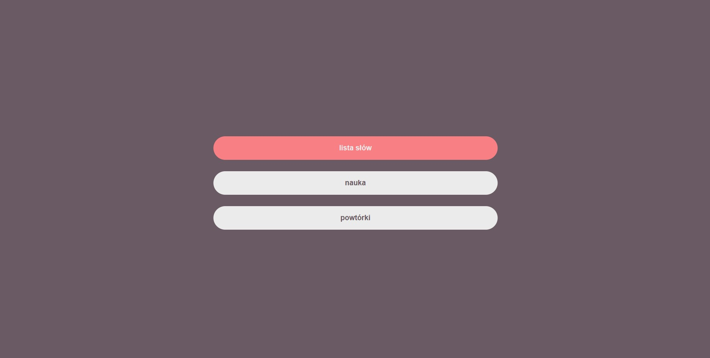
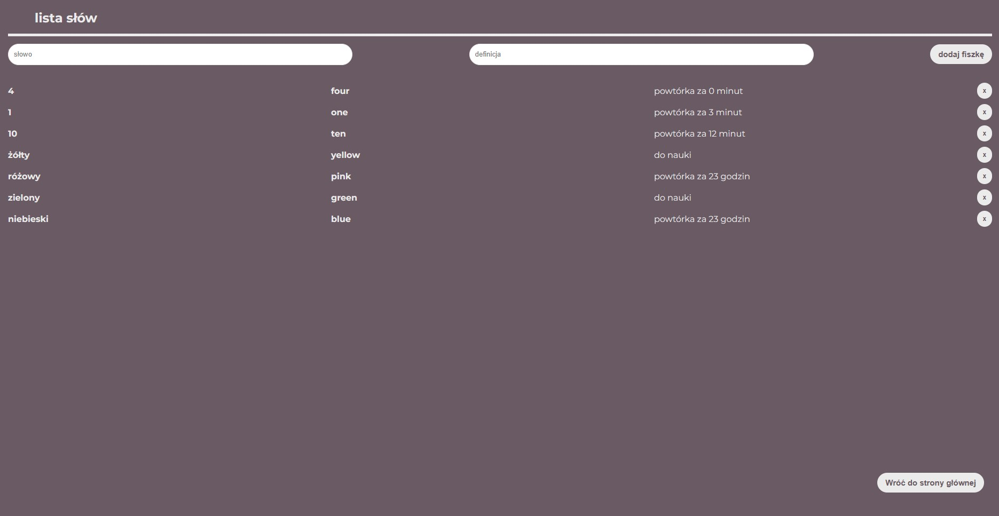
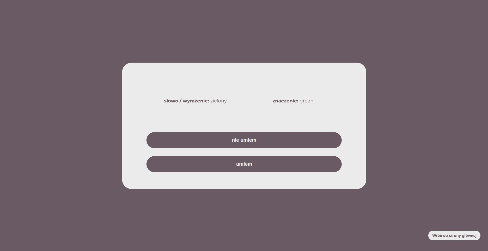

# Flashcards app

This app is made with react and the data is stored in localStorage. You can add words to wordlist and delete those words. There is also study page and revision page, where you can learn or revise material. There are revision intervals. The flashcards are shown in random order. 

## home page

## hover button

## word list

## flashcard

